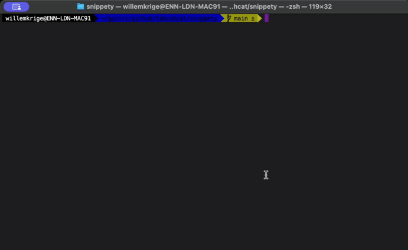

# ✂️ Snippety

[](https://golang.org)
[](LICENSE)
[](https://github.com/tahcohcat/snippety/releases)
[](https://github.com/tahcohcat/snippety/actions)
[](https://github.com/tahcohcat/snippety/actions)
[](https://goreportcard.com/report/github.com/tahcohcat/snippety)
[](https://ollama.ai)

AI-powered Go CLI tool that generates commit messages from staged git changes using Ollama.

## Demo



*Snippety automatically detects your branch, analyzes changes, and generates structured commit messages with both title and description.*

## Features

- 🤖 **AI-Generated Messages**: Uses Ollama to generate meaningful commit messages with both title and detailed description
- 🎫 **Smart Branch Detection**: Automatically detects ticket prefixes from branch names (e.g., `BP-1234-feature` → `BP-1234: commit title`)
- 📝 **Conventional Commits**: Follows conventional commit format (Add, Fix, Update, Remove)
- 🎭 **Flexible Tones**: Choose from built-in tones (professional, fun, pirate, haiku, serious) or specify custom tones
- 🤝 **Interactive Mode**: Optionally confirm before creating and pushing commits with generated messages
- 📁 **Auto-staging**: Automatically stages all changes with `git add -A` before analysis (can be disabled)
- 🔄 **Fallback Support**: Falls back to rule-based generation if Ollama is unavailable
- 🌊 **Smart Push Handling**: Automatically sets upstream for new branches during push
- ⚙️ **Configurable**: Supports custom Ollama endpoints and models
- 🧪 **Well-Tested**: Comprehensive unit test coverage for reliability
- 🚀 **Fast & Lightweight**: Built with Go and Cobra CLI framework

## Prerequisites

- [Ollama](https://ollama.ai/) installed and running
- Go 1.21 or later
- Git repository with staged changes

## Installation

```bash
# Clone the repository
git clone https://github.com/tahcohcat/snippety/snippety
cd snippety

# Build the binary
go mod tidy
go build -o snippety ./cmd/snippety

# Optional: Install globally
go install ./cmd/snippety
```

## Quick Start

1. **Start Ollama**:
```bash
ollama serve
```

2. **Pull a model** (if not already available):
```bash
ollama pull llama3.2
```

3. **Generate commit message** (auto-stages changes by default):
```bash
./snippety

# Or with interactive confirmation:
./snippety --interactive
```

## Usage

### Basic Usage
```bash
./snippety
```

### Custom Ollama Configuration
```bash
# Custom Ollama server URL
./snippety --ollama-url http://localhost:11434

# Different model
./snippety --model llama3.1

# Custom tone
./snippety --tone fun

# Interactive mode
./snippety --interactive

# Disable auto-staging (manual git add required)
./snippety --auto-stage=false

# Combined options
./snippety --ollama-url http://remote-server:11434 --model codellama --tone pirate --interactive
```

### Tone Options

#### Built-in Tones
```bash
# Professional tone (default)
./snippety --tone professional

# Fun tone with emojis and creative language
./snippety --tone fun

# Pirate speak with nautical terminology
./snippety --tone pirate

# Haiku poem with 5-7-5 syllable structure (single line)
./snippety --tone haiku

# Serious, formal tone with technical precision
./snippety --tone serious
```

#### Custom Tones
You can also specify any custom tone as a string:
```bash
# Custom tones - the AI will interpret and apply the tone
./snippety --tone casual
./snippety --tone dramatic
./snippety --tone technical
./snippety --tone poetic
./snippety --tone "like a tech startup CEO"
./snippety --tone "in the style of Shakespeare"
```

### Command Line Options

| Flag | Default | Description |
|------|---------|-------------|
| `--ollama-url` | `http://localhost:11434` | Ollama server URL |
| `--model` | `llama3.2` | Ollama model to use for generation |
| `--tone` | `professional` | Tone for commit messages (professional, fun, pirate, haiku, serious, or custom) |
| `--interactive` | `false` | Interactively confirm before creating and pushing the git commit |
| `--auto-stage` | `true` | Automatically stage all changes with 'git add -A' before analysis |

## Example Output

```bash
$ ./snippety
Staging all changes...
Generating commit message with Ollama...
Making request to: http://localhost:11434/api/generate
Generated commit message:
Add user authentication middleware

$ ./snippety --tone fun
Generating commit message with Ollama...
Generated commit message:
✨ Add shiny new user auth middleware 🔐

$ ./snippety --tone pirate
Generating commit message with Ollama...
Generated commit message:
Hoist new authentication middleware aboard! ⚓

$ ./snippety --tone haiku
Generating commit message with Ollama...
Generated commit message:
Auth middleware flows / Through the codebase like fresh streams / Security blooms bright

$ ./snippety --interactive
Staging all changes...
Generating commit message with Ollama...
Generated commit message:
Add user authentication middleware

Do you want to create a commit with this message? (y/N): y
✅ Commit created successfully!
🚀 Commit pushed successfully!
```

## How It Works

1. **Branch Detection**: Detects current branch and extracts ticket prefixes (e.g., `FEAT-1234-feature` → `FEAT-1234:`)
2. **Auto-staging**: Automatically runs `git add -A` to stage all changes (unless disabled)
3. **Git Diff Analysis**: Retrieves staged changes using `git diff --staged`
4. **AI Processing**: Sends the diff to Ollama with a specialized prompt for title and description generation
5. **Tone Application**: Applies built-in or custom tone instructions to the AI prompt
6. **Commit Generation**: Returns a structured commit message with title and detailed description
7. **Prefix Integration**: Automatically prepends ticket prefix to commit title
8. **Interactive Confirmation**: Optionally prompts user to create commit and push
9. **Smart Push**: Automatically sets upstream for new branches during push
10. **Fallback**: Uses rule-based analysis if Ollama is unavailable

## Supported Models

Any Ollama model should work, but these are recommended:

- `llama3.2` (default) - Good balance of speed and quality
- `llama3.1` - Larger model for better accuracy
- `codellama` - Specialized for code analysis
- `mistral` - Fast and efficient
- `qwen2.5-coder` - Excellent for code understanding

## Troubleshooting

### Ollama Connection Issues

```bash
# Check if Ollama is running
curl http://localhost:11434/api/tags

# Start Ollama if not running
ollama serve

# Verify model availability
ollama list
```

### Common Errors

- **"connection refused"**: Ollama service is not running
- **"405 Method Not Allowed"**: Wrong URL or port
- **"No staged changes found"**: Run `git add` to stage your changes first

## Development

### Project Structure
```
snippety/
├── cmd/main.go              # Entry point
├── internal/
│   ├── cmd/                 # Cobra CLI commands
│   │   ├── root.go         # Root command setup
│   │   └── generate.go     # Core generation logic
│   └── ollama/             # Ollama client
│       └── client.go       # HTTP client for Ollama API
├── go.mod                  # Go module definition
└── README.md              # This file
```

### Building from Source

```bash
# Using Make (recommended)
make dev          # Install deps, build, and test
make build        # Build binary only
make test         # Run tests
make test-coverage # Run tests with coverage report

# Or manually with Go commands
go mod tidy       # Get dependencies
go test ./...     # Run tests
go build -o snippety ./cmd/snippety  # Build binary

# Cross-compile for different platforms
make build-all    # Build for all platforms (Linux, macOS, Windows)
```

### Testing

The project includes comprehensive unit tests covering:

- **Ticket prefix extraction** from branch names
- **Commit message parsing** with various LLM response formats  
- **Fallback message generation** when Ollama is unavailable
- **CLI flag parsing and validation**
- **Client configuration and setup**

```bash
# Run all tests
make test

# Run tests with verbose output  
make test-verbose

# Generate coverage report
make test-coverage
```

**Test Coverage:**
- `internal/cli/git`: ~30% (core git functionality, branch detection, fallback generation)
- `internal/client/ollama`: ~48% (LLM client, response parsing, tone handling)
- `internal/cli/cobra`: ~44% (CLI command parsing, flag validation, custom tones)

**Key Test Areas:**
- ✅ Ticket prefix extraction from 17+ branch name patterns
- ✅ Commit message parsing with 11 different LLM response formats
- ✅ Fallback message generation for 8 git diff scenarios  
- ✅ Custom and built-in tone instruction generation
- ✅ CLI flag parsing and validation

## Contributing

1. Fork the repository
2. Create a feature branch (`git checkout -b feature/amazing-feature`)
3. Commit your changes (`git commit -m 'Add some amazing feature'`)
4. Push to the branch (`git push origin feature/amazing-feature`)
5. Open a Pull Request

## License

This project is licensed under the MIT License - see the [LICENSE](LICENSE) file for details.

## Acknowledgments

- [Ollama](https://ollama.ai/) for the local LLM runtime
- [Cobra](https://github.com/spf13/cobra) for the CLI framework
- [Conventional Commits](https://www.conventionalcommits.org/) for the commit format standard
